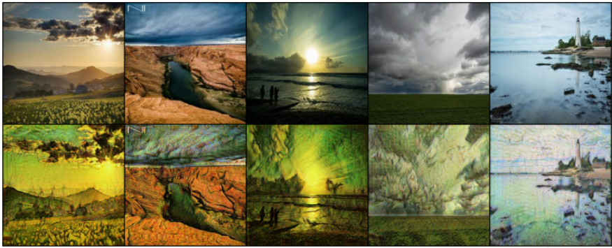

# AI-Powered Van Gogh Style Transformer

## Project Overview

This project harnesses the power of artificial intelligence to transform modern photographs into artworks mirroring the style of Vincent Van Gogh. Utilizing CycleGAN, a cutting-edge generative adversarial network, we've trained our model on a comprehensive dataset comprising over 9,000 artworks and photographs. Our aim is to bridge the gap between contemporary images and impressionist art, bringing a modern twist to classic styles.

## Results and Demonstrations

